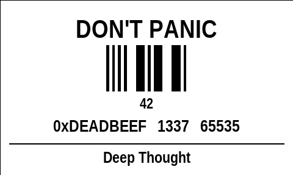
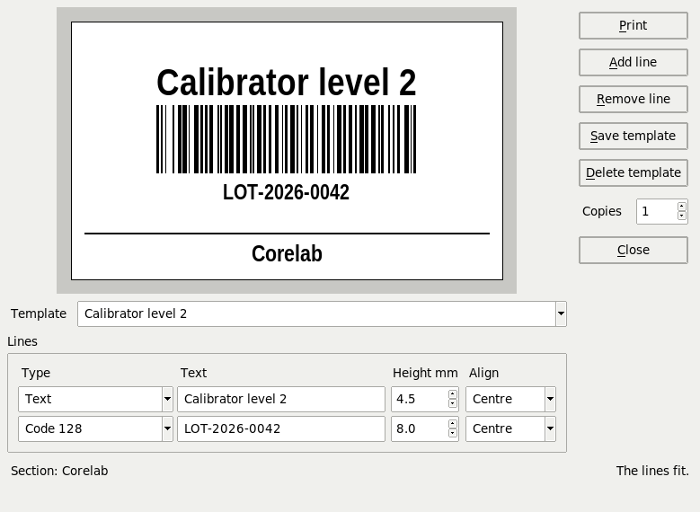

# pittacium

[](https://www.python.org/downloads/)
[](https://docs.python.org/3/library/tk.html)
[](https://www.sqlite.org/index.html)
[](https://en.wikipedia.org/wiki/Zebra_Programming_Language)
[](#target-environment)
[](LICENSE)

*pittacium, -i* (Latin, from Greek *pittakion*): a label, a tag. Petronius
describes the wine jars at Trimalchio's dinner with *pittacia* tied to
their necks, saying what was inside.

**Clear, uniform labels for the laboratory bench: bottles, boxes, tubes.**



A small desktop application to print text labels on the laboratory label
printer, without opening Inventarium. Python, Tkinter, SQLite, standard
library only.

## Why

Labels on the bench are still written by hand, and everybody writes them
their own way. A pittacium label is the fair copy of a handwritten one:
whatever would have been written by hand, printed legibly and the same
for everyone. The same kind of container carries the same information,
in the same order, in the same place. Colleagues asked for it; the printer is already there
and well liked.

Inventarium already has a custom-label window. pittacium takes that idea
out on its own, for people who have no reason to open an inventory to
write "PBS 1X" on a bottle.

## What it does



- Prints text labels in a few **formats**, one per kind of container,
  each with its size in millimetres.
- The number of lines on a label is variable, within what the format can
  hold.
- A line is either **text or a barcode**.
- **Every label carries the name of the section** in a band at the
  bottom — Corelab, Spettrometria di Massa, Ematologia. It is set once
  per workstation in `pittacium.ini`, never typed at print time, so it is
  spelt the same way on every label from that bench. Until it is set, the
  band reads "Lab".
- **Shows the label on screen** as it is typed, so a line that does not
  fit is seen before a label is wasted. Linear barcodes are drawn bar by
  bar; Data Matrix and QR as a box of the right size.
- Keeps **templates** of the labels printed most often, the same for
  everybody.

## What it does not do

- It is not an inventory: no stock, no lots, no expiry tracking. That is
  Inventarium.
- It does not remember what it printed. A label may carry anything a
  handwritten one would — a tube brought in for research may well have a
  name on it — and none of it stays behind: not in the database, not in
  the log. Only the templates someone chooses to save are kept.
- It is not a sample-identification system: it prints the barcode it is
  given, tied to no record, with no link to the laboratory information
  system.

## Design decisions

- **Formats are in millimetres**, and know nothing about the printer. A
  new printer, or a different resolution, does not invalidate them.
- **The printer is data, not code**: a profile with its language,
  resolution, head width, and the options of that language. Replacing it
  is a change of configuration.
- **Meant for similar label printers, not only one.** Each printer
  language has one class that turns the layout into commands; no other
  part of the program writes a printer command. ZPL II is implemented,
  which also covers printers with a ZPL emulation. TSPL or EPL are added
  the day there is a printer to test them on: a class nobody has seen
  print is not support. Printers that only take a driver (Brother QL,
  Dymo) are out of scope.
- **Barcodes are drawn by the printer**, at its own resolution:
  Interleaved 2 of 5 and Code 128 first, then Code 39, Codabar, Data
  Matrix, QR. The data is checked against the symbology before printing,
  and a symbol that does not fit the label at a readable bar width is
  refused, not squeezed.
- **One layout, two renderers.** `Layout` computes once where every line
  goes and how tall it is, in printer dots. `Zpl` turns it into commands,
  `Preview` draws it on a Tk canvas. The positions are written in one
  place, so the preview cannot drift from the print.
- **The preview is faithful in positions and sizes, approximate in the
  shape of the letters**: the Zebra uses its own font (`^A0`), the screen
  a similar one. The test label printed on the real printer is the final
  check.
- **No Pillow, no driver.** The printer draws the text itself at its own
  resolution: sharp, and a job of a few hundred bytes.
- **A label that was not printed is never reported as printed.** Three
  transports: `raw` through the system queue, `tcp` straight to port
  9100, `file` for testing, which writes the ZPL and says loudly that
  nothing was printed. Every attempt goes to the log.

The printing approach comes from first_sign, where it already runs on the
laboratory printer.

- **One installation per section.** Each section has its own copy, its
  own database and its own templates, shared by whoever works there; no
  two workstations write to the same file over the network.

## Target environment

| | |
|---|---|
| Laboratory | Windows 10 LTSC 2019, Python 3.7.0, SQLite 3.21.0 |
| Development | Debian 12, Python 3.11, SQLite 3.40 |
| Printer (2026) | Zebra GX430T, 300 dpi, thermal transfer, gap sensor |
| Label stock | 50 x 30 mm, the roll first_sign and Inventarium print on |
| Dependencies | none required; `pywin32` only for the `raw` transport on Windows |

## Running

```
python3 pittacium.py            start it
python3 pittacium.py --trace    and print on the terminal what it does
python3 -m unittest discover -s tests -v
```

The first start makes `pittacium.ini` from `pittacium.ini.example` and the
database from `sql/`. On Debian, tkinter needs the `python3-tk` package.

On Windows, a build in one folder, with pywin32 installed for the raw
transport:

```
py -3.7 -m PyInstaller --clean --noconfirm pittacium.spec
```

`pittacium.spec` says why each choice is made. Copy `dist/pittacium`
somewhere else to install it: the next build rewrites `dist/`.

## Conventions

The general rules are in
[fundamenta/python.md](https://github.com/1966bc/fundamenta); what is
particular to this project is in [CONVENTIONS.md](CONVENTIONS.md).

## Licence

GNU GPL v3 or later, see `LICENSE`.

*Giuseppe Costanzi — [github.com/1966bc](https://github.com/1966bc)*
